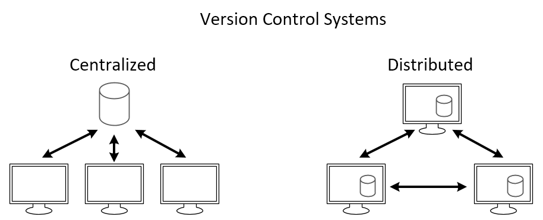

# API

## API (Application Programming Interface)

An API is the messenger that takes requests and tells a system what you want to do and then returns the response back to you.
They are used to enable the integration of different systems, allowing them to share data and functionality. 

APIs are popular because they simplify the process of building software by providing pre-built functionality (i.e. standardised methods for interacting with software components) that developers can use, saving time and effort.

## REST API (Representational State Transfer API)

REST is the most popular API architecture for transferring data over the internet.  It relies on standard HTTP methods like GET, POST, PUT, and DELETE to perform operations on resources, making it widely accessible and easy to understand.

REST APIs are commonly used for building modern web applications, enabling efficient communication between clients and servers while maintaining flexibility and compatibility.

## HTTP

HTTP (Hypertext Transfer Protocol) is a protocol used for transmitting data over the internet. It defines the rules for how messages are formatted and transmitted, allowing web servers and browsers to communicate.

## Structure of HTTP

### HTTP Request Structure
An HTTP request consists of a request line, headers, and an optional message body. The request line includes the HTTP method/verb (such as GET or POST), the URL of the requested resource, and the protocol version.

### HTTP Response Structure

An HTTP response includes a status line, headers, and an optional message body. The status line indicates the outcome of the request (such as 200 for success or 404 for not found).

## HTTP Verbs
HTTP verbs, also known as methods, define the actions that can be performed on a resource identified by the request URL.
- GET: Retrieves data from the server.
- POST: Submits data to the server.
- PUT: Updates data on the server.
- PATCH: Partially updates data on the server.
- DELETE: Removes data from the server.

## Statelessness

- HTTP is a stateless protocol, meaning that each request from a client to a server is independent and unrelated to any previous requests. The server does not retain any information about past requests or client sessions between requests. 
- This design simplifies server implementation and improves scalability but requires additional mechanisms (such as cookies or session tokens) to manage user sessions and maintain state across multiple requests.

## Caching

- Caching is a technique used to store copies of frequently accessed data or resources in a temporary storage location, such as the client's browser or a proxy server. 
- By caching data locally, subsequent requests for the same data can be served more quickly, as the server or network doesn't need to retrieve it again. 
- This helps to reduce latency, bandwidth usage, and server load, leading to faster and more efficient web browsing experiences.

