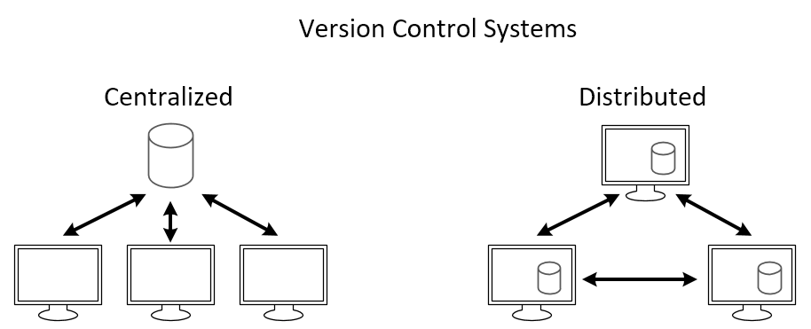
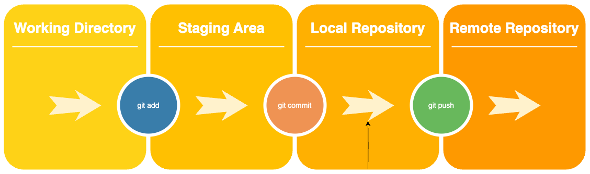

## Version Control System

### Centralised vs distributed 

A Centralised Version Control System is a version control system where a central repository stores the entire history of the project. Developers check out a working copy of the code from the central repository onto their local machines, make changes locally, and then commit those changes back to the central repository.  

A Distributed Version Control System is a version control system that does not rely on a central repository. Instead, each developer has a complete copy of the repository, including the entire project history, on their local machine. Developers can work independently, committing changes to their local repository and later pushing those changes to share with others.



## Git

### Check your Git version
To check your version of Git:
```commandline
git --version
```

### The Three Stages in Git
1. **Untracked:** modified files/folders that have not been staged.
2. **Tracked:** modified files/folders that have been staged.
3. **Committed:** modified files/folders that have been committed.

### Git workflow commands
- `git init` - to initialise Git.
- `git status` - to see if there's an existing git repo OR to view the status of changes as untracked, modified, or staged.
- `git add .` to move files from the working directory into the staging area.
- `git commit -m "[desired-message]"` - to commit changes and store the version in the local repository.
- `git push` - to copy all the content from the local repository into the remote repository.

## Safeguarding and versioning
Before copying code to GitHub, make sure there is no sensitive information in the local repository (e.g. passwords, encryption keys, pins).

- Have a `.gitignore` file to exclude certain files from version control in Git.
- Run the command `git ls-files` to see whether any files which might contain sensitive information are in the repo.
- Inspect previous commits (snapshots) and delete immediately if already pushed to the remote repo.

### .gitignore

The purpose of `.gitignore` is to tell Git which files and patterns to exclude when staging changes or creating commits. It helps keep your repository clean, avoids unnecessary clutter, and prevents sensitive information from being accidentally committed.

### Managing commits

**Log of commits** <br>
To view a log of your commits and their IDs:
```
git log
```
**Difference between commits**<br>
To compare two commits (i.e. two versions/snapshots):
```
git diff [old-commitID] [new-commitID]
```
> Example: Let's say the commit ID for version 1 is 12345 and the commit ID for version 1 is 67890.
The command to run would be `git diff 12345 67890`

_Any new additions will start with a plus sign (+) and any deletions will start with a minus sigh (-)._

**Checkout commits**<br>
- To checkout a specific version based on its commit ID:

    ```
    git checkout [commitID]
    ```
- To return to the latest version of the main branch:
    ```
    git checkout main
    ```
    _This is assuming your main branch is called 'main'; it might be 'master' in some repositories._

**Revert to previous state**<br>
If you want to reset your current branch to a previous commit, you can use the reset command:
```
git reset --hard [commitID]
```
_This command resets the specified commit, and it discards all changes after that commit. Be careful when using a hard reset, as it permanently deletes committed and uncommitted changes._

### Removing files or directories from future snapshots

You may have committed a file or directory that you want to remove from future snapshots or commits without deleting them from the working directory. Or perhaps you want to remove a file or directory from the Git index (i.e., the staging area). You can do this by running either:
- `git rm --cached [your-file]` to remove files from the staging area.
- `git rm --cached -r [your-directory]/` to remove a directory recursively from the staging area (including all its contents), using the the -r or --recursive flag.

For example, run the following to remove the **.venv** directory:
```
git rm --cached -r .venv/
```
_Note: Best practice is to add the **.venv** folder to the **.gitignore** file before performing any staging and commits._

## Copying a local repo to GitHub

1. Create an empty repository on GitHub.
2. establish a connection between the local repository and the remote repository.
3. Run `git push` to push changes from local to remote repo.

### Remote Git Status Changes


### Establish a connection
In order to **push** to the remote repository, you need to first establish a connection between the local repository and the remote repository (e.g., GitHub) with proper authentication. Two common methods for establishing this connection are HTTPS and SSH. 
- With the HTTPS approach, you'll need to use a Personal Access Token for authentication.
- Alternatively, with the SSH approach, you'll need to set up a key pair for authentication.

## Copying a GitHub repo locally
1. Create a repository on GitHub with files and directory.
2. Run `git clone` with the HTTPS URL for the repo or use SSH is you have set up the keys.

## Branching
Branching is a feature in Git that allows you to branch off from the main line of development and continue working without affecting the main codebase. This makes branching a powerful feature that promotes collaboration, experimentation, and version control in software development workflows.
