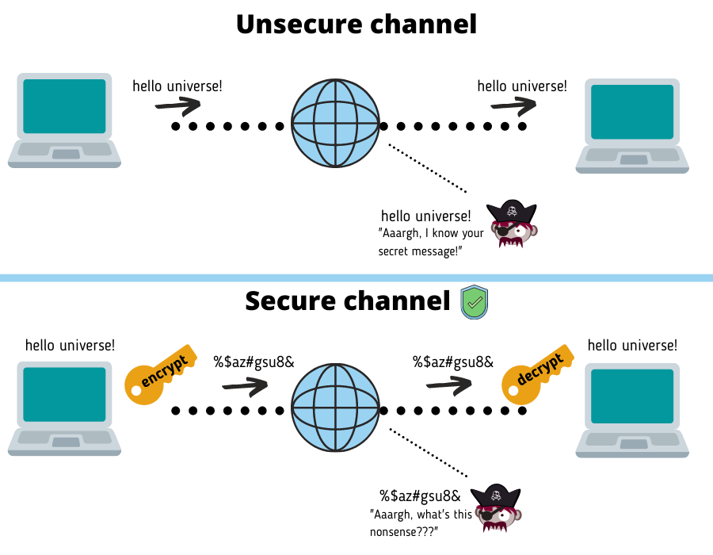
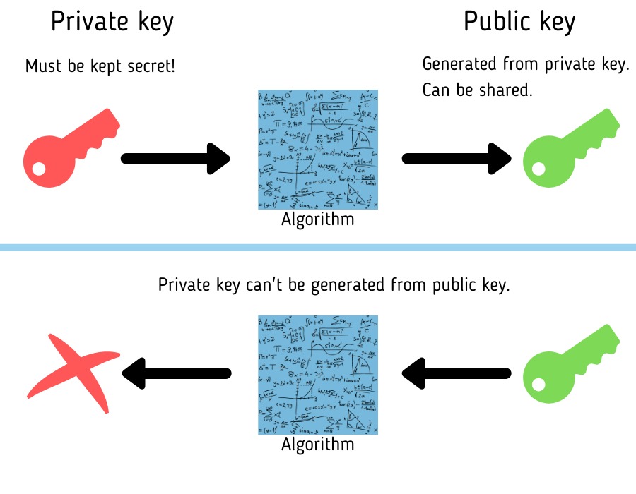

# Secure Shell

SSH stands for Secure Shell. 

It's a way to securely connect to another computer over the internet. 



## Why use SSH over HTTPS?
- **More secure**: SSH keeps your data safe when you're sending it between computers. This is great for things like passwords and sensitive information.
- **Safer authentication**: SSH uses strong authentication methods (public-key cryptography) for authentication, which is more secure than traditional username/password authentication used in HTTPS.
- **Automation**: With SSH, you can automate tasks, like setting up servers or deploying software, so you don't have to do everything manually.
- **Access to inside stuff**: SSH can also be used to securely access things inside private networks, like databases or other services, even when you're not physically there.

## Create an SSH key pair

You can use SSH to securely interact with GitHub repositories.

1. Open your terminal.

2. Navigate into your .ssh directory:
    ```bash
    cd ~/.ssh/
    ```
3. Generate a new SSH key pair:
    ```bash
    ssh-keygen -t rsa -b 2048 -C "[your-email]"
    ```

   You'll be prompted to enter a filename for the key. Otherwise press **Enter** to accept the default name `id_rsa`.


4. Copy the public key:

    ```bash
    cat ~/.ssh/id_rsa.pub
    ```
   Replace `id_rsa` if you used a different filename.


5. Add SSH Key to GitHub Repository:
   - Go to your GitHub repository settings.
   - Click on "Deploy keys", then "Add deploy key".
   - Type in a title and paste the copied public key into the "Key" field.
   - Click "Add key".


6. Start the SSH agent:
    ```bash
    eval `ssh-agent`
    ```
7. Add your SSH private key to the SSH agent:

    ```bash
    ssh-add ~/.ssh/id_rsa
    ```
   Replace `id_rsa` if you used a different filename.


8. Test the connection to GitHub:
    ```bash
    ssh -T git@github.com
    ```

## Best Practices for SSH
- Use strong passwords
- Don't log in as root user
- Keep your software updated
- Use key-based authentication
- Limit your SSH access
- Watch out for suspicious activity
- Do not expose your private SSH key


